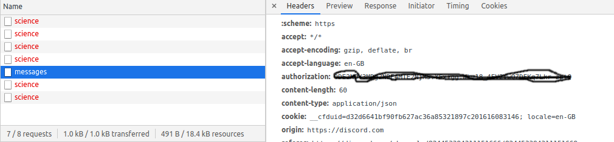

# How to send a message in discord to a specific channel 

## curl 

```
curl -i -H "Accept: application/json"
-H "Content-Type:application/json"
-H "Authorization: TOKEN"
-X POST --data "{"content": "hello world"}"
https://discord.com/api/v8/channels/816350000862461982/messages
```

## script in python

```python
#!/usr/bin/python3

import requests

# message
payload = {
    'content': 'hello world'
}

header = {
    'authorization': 'TOKEN'
}

# channel redlive13
r = requests.post(
    'https://discord.com/api/v8/channels/816350000862461982/messages', data=payload, headers=header)
```

